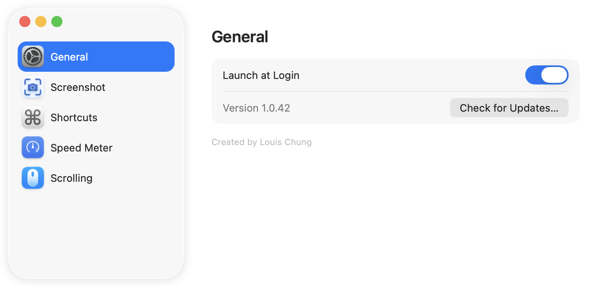
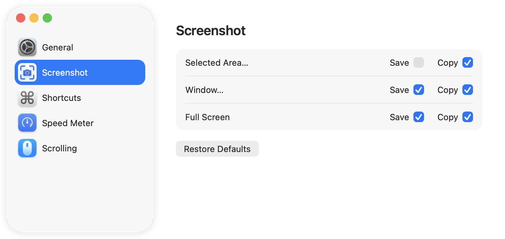
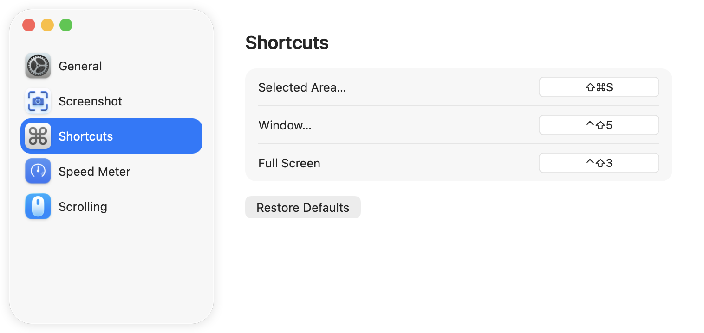
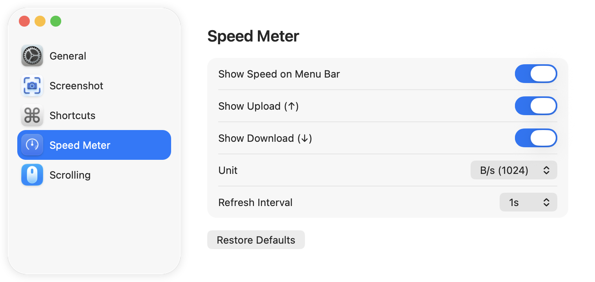
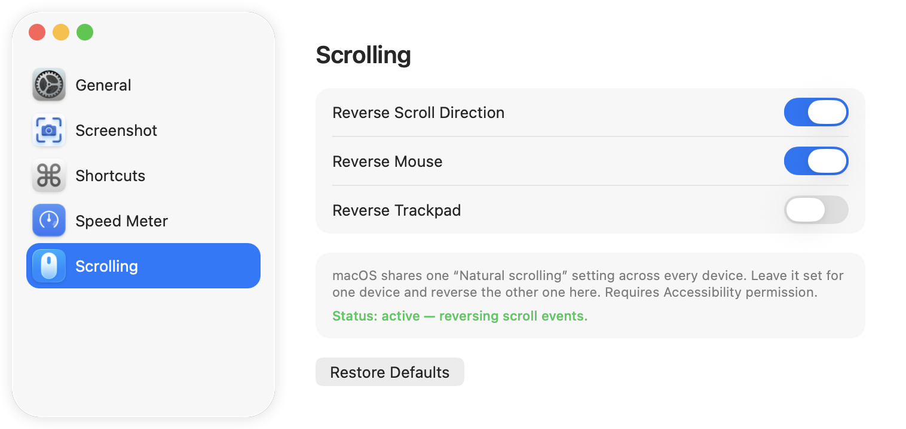

# Tide

macOS menu bar app: tốc độ mạng thời gian thực, chụp ảnh màn hình, và hướng cuộn riêng cho chuột với trackpad — tất cả gọn trong một icon trên menu bar, không chiếm chỗ ở Dock.

Tạo bởi **Louis Chung**.



## Tính năng

### Tốc độ mạng trên menu bar

- Hiển thị 2 dòng xếp chồng ngay trên menu bar — `↑ 13 KB/s` ở trên, `↓ 1.6 MB/s` ở dưới.
- Chỉ cộng lưu lượng của card mạng vật lý (Wi-Fi/Ethernet, `en*`); bỏ qua loopback và interface ảo (VPN, bridge…) để không đếm trùng.
- Chọn được đơn vị (`B/s` cơ số 1024, `B/s` cơ số 1000, hoặc `bit/s`), nhịp cập nhật (0.5s / 1s / 2s / 5s), và ẩn/hiện riêng từng dòng ↑ ↓.
- Đầu menu hiện **tên nhà mạng + IP công cộng**, dạng `VNPT Corp 14.161.12.83` — đây là IP WAN do ISP cấp, không phải IP LAN. Tra qua API công khai `ipinfo.io` (HTTPS), mỗi lần mở app chỉ gọi 1 lần (lỗi thì thử lại ở lần mở menu kế tiếp). Lưu ý: bước tra cứu này gửi IP công khai của bạn tới `ipinfo.io`.

### Chụp ảnh màn hình

- 3 chức năng ngay trong menu: **Selected Area… / Window… / Full Screen**, kèm phím tắt hiện tại của từng mục (vd. `Selected Area…  ⌃⇧4`).
- Mỗi chức năng có 2 đích **độc lập, dùng song song được**: lưu `.png` vào `~/Desktop` và/hoặc copy vào clipboard. Bật cả hai thì một lần chụp ra cả file lẫn clipboard; chỉ bật Copy thì không sinh file thừa (dùng thẳng `screencapture -c`).
- Chụp xong menu bar nháy **"✓ Saved"**, **"✓ Copied"** hoặc **"✓ Saved & Copied"** kèm tiếng chụp ngắn trong ~1.2s rồi tự trở về hiển thị tốc độ mạng.
- Phím tắt là **toàn cục** — bấm được ở bất kỳ đâu, không cần mở menu Tide trước và không cần quyền Accessibility. Mặc định `⌃⇧3` (Full Screen), `⌃⇧4` (Selected Area), `⌃⇧5` (Window); chọn Control thay vì Command để không đụng phím tắt chụp ảnh sẵn có của macOS.

### Hướng cuộn riêng cho chuột và trackpad

macOS chỉ có **một** công tắc "Natural scrolling" dùng chung cho mọi thiết bị trỏ: chỉnh đúng chiều cho trackpad thì con chuột bị ngược, và ngược lại.

Tide giải quyết bằng cách để nguyên setting của hệ thống cho một thiết bị, rồi đảo chiều thiết bị còn lại:

- Bật **Reverse Scroll Direction**, rồi chọn **Reverse Mouse** và/hoặc **Reverse Trackpad**. Muốn hai thiết bị ngược chiều nhau thì chỉ bật một trong hai.
- Phân biệt chuột với trackpad theo **đúng thiết bị phát ra event** (đọc IORegistry), không dựa vào kiểu event: Magic Mouse cũng gửi scroll dạng pixel y hệt trackpad nên cách nhận diện thông thường sẽ nhầm nó thành trackpad.
- Chỉ đảo trục dọc — trục ngang giữ nguyên cho các gesture vuốt qua lại.
- Cần quyền **Accessibility**; cấp xong là chạy ngay, không phải khởi động lại app.

### Khác

- **Launch at Login** — tự khởi động cùng macOS (chỉ hoạt động khi chạy từ bản `.app` đã đóng gói).
- **Tự động cập nhật** — mỗi lần mở app tự kiểm tra ngầm bản mới trên GitHub Releases (im lặng nếu đã mới nhất); có bản mới thì hỏi cài luôn: tải `.zip` của release, giải nén, thay thế `/Applications/Tide.app` rồi tự khởi động lại. Kiểm tra thủ công bằng nút **Check for Updates…** trong Settings → General.
- Không có icon ở Dock (`LSUIElement`), chỉ nằm trên menu bar.

## Cửa sổ Settings

Dạng sidebar-tabs giống System Settings, chia theo chức năng. Mỗi nhóm có nút **Restore Defaults** riêng, không ảnh hưởng các nhóm khác.

**Screenshot** — 2 checkbox Save/Copy độc lập cho từng chức năng (không cho tắt cả hai cùng lúc).



**Shortcuts** — bấm vào ô để ghi tổ hợp mới, Esc để huỷ, Delete để xoá.



**Speed Meter** — bật/tắt hiển thị tốc độ, chọn dòng ↑ ↓, đơn vị và nhịp cập nhật.



**Scrolling** — đảo hướng cuộn riêng cho chuột và trackpad, kèm dòng trạng thái cho biết đang chạy hay còn chờ quyền.



## Cài đặt

1. Tải `Tide-vX.Y.Z.zip` ở [releases/latest](https://github.com/tuchung95/Tide/releases/latest).
2. Giải nén và kéo `Tide.app` vào `/Applications`.
3. Lần đầu mở: app ký bằng certificate tự tạo (không notarize) nên Gatekeeper sẽ chặn — chuột phải vào app → **Open** → **Open** lần nữa.

Yêu cầu macOS 13 (Ventura) trở lên.

## Quyền cần cấp

| Quyền | Dùng cho | Khi nào hỏi |
|---|---|---|
| **Screen Recording** | Chụp ảnh màn hình | Lần chụp đầu tiên |
| **Accessibility** | Đảo hướng cuộn theo thiết bị | Khi bật Reverse Scroll Direction |

Nếu System Settings đã hiện Tide được bật mà app vẫn báo thiếu quyền: tắt rồi bật lại mục Tide trong danh sách. macOS gắn quyền theo từng bản build, nên một entry cũ vẫn nằm trong danh sách nhưng không còn hiệu lực.

## Build từ source

Cần Xcode Command Line Tools (có `swiftc`, `codesign`), **không cần** Xcode.app đầy đủ.

```bash
# Build + ký + cài đè vào /Applications + publish GitHub Release
./Scripts/build_app.sh

# Chỉ build + cài local, giữ nguyên version, không publish
SKIP_RELEASE=1 ./Scripts/build_app.sh
```

Script compile thẳng bằng `swiftc` (SwiftPM cần SDK path chỉ có trong Xcode.app đầy đủ), tự tăng patch version trong `Resources/VERSION`, đóng gói `Tide.app`, rồi ký bằng certificate `Tide Local Dev` nếu máy có sẵn — chữ ký ổn định qua các lần rebuild giúp macOS không đòi cấp lại quyền — không có thì rơi về ký ad-hoc.
