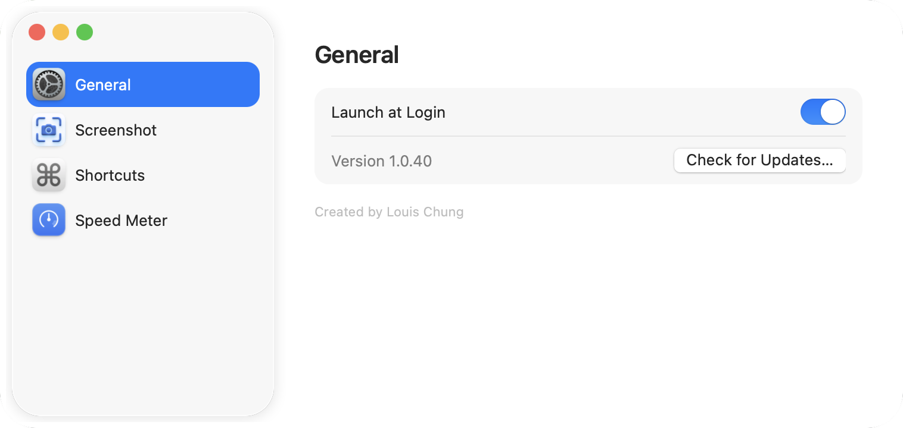

# Tide

macOS menu bar app: hiển thị tốc độ tải xuống/tải lên theo thời gian thực, kèm công cụ chụp ảnh màn hình (vùng chọn / cửa sổ / toàn màn hình) ngay trong menu.

Tạo bởi **Louis Chung**.

## Tính năng

- Hiển thị tốc độ mạng dạng 2 dòng xếp chồng (`↑ 13 KB/s` trên, `↓ 1.6 MB/s` dưới) trực tiếp trên thanh menu bar, cập nhật mỗi giây.
- Tổng hợp lưu lượng từ các card mạng vật lý (Wi-Fi/Ethernet, `en*`), bỏ qua loopback và các interface ảo (VPN, bridge...) để tránh đếm trùng.
- Đầu menu hiển thị **tên nhà mạng + địa chỉ IP công cộng** hiện tại, dạng `{{tên nhà mạng}} {{IP}}` (vd. `VNPT Corp 14.161.12.83`) — đây là IP WAN do ISP cấp, không phải IP LAN nội bộ. Lấy qua API công khai `ipinfo.io` (HTTPS), chỉ gọi 1 lần mỗi lần mở app (retry ở lần mở menu kế tiếp nếu lần đầu lỗi) để hạn chế gửi request. Lưu ý: việc tra cứu này gửi IP công khai của bạn tới `ipinfo.io`.
- Chụp ảnh màn hình từ menu — **Selected Area… / Window… / Full Screen**:
  - Mỗi chức năng có 2 đích **độc lập, dùng song song được**: lưu file `.png` vào `~/Desktop` và/hoặc copy vào clipboard. Bật cả hai thì chụp 1 lần ra cả file lẫn clipboard; chỉ bật 1 trong 2 thì chỉ làm đúng việc đó (không tạo file thừa khi chỉ muốn copy — dùng thẳng `screencapture -c`). Bật/tắt trong **Settings…**.
  - Sau khi chụp thành công, menu bar nhấp nháy **"✓ Saved"**, **"✓ Copied"**, hoặc **"✓ Saved & Copied"** (tuỳ đích nào đang bật) kèm âm thanh ngắn (`Resources/CaptureSound.mp3`) trong ~1.2s rồi tự trở về hiển thị tốc độ mạng.
  - Mỗi mục hiển thị luôn phím tắt hiện tại của nó bên cạnh tên (vd. `Selected Area…    ⌃⇧4`).
- **Settings…** — cửa sổ cài đặt dạng sidebar-tabs (giống System Settings), chia theo chức năng:
  - **General**: **Launch at Login** — bật/tắt tự khởi động cùng macOS (chỉ hoạt động khi chạy từ `.app` đã đóng gói, xem bên dưới); hiển thị version hiện tại + nút **Check for Updates…**.
  - **Screenshot**: với mỗi chức năng (Selected Area / Window / Full Screen) — 2 checkbox **Save**/**Copy** độc lập (không cho tắt cả hai cùng lúc), "Restore Defaults" riêng cho nhóm này.
  - **Shortcuts**: ô ghi phím tắt **toàn cục** cho từng chức năng, bấm được ở bất kỳ đâu trên macOS mà không cần mở menu Tide trước, không cần cấp quyền Accessibility. Mặc định `⌃⇧3/4/5` (Full Screen/Selected Area/Window) — chọn Control thay vì Command để không đụng phím tắt chụp ảnh có sẵn của macOS. Bấm vào ô để ghi lại tổ hợp mới, Esc để huỷ, Delete để xoá, "Restore Defaults" riêng cho nhóm này.
- **Tự động cập nhật**: mỗi lần mở app tự kiểm tra ngầm bản mới trên GitHub Releases (im lặng nếu đã là bản mới nhất); có bản mới thì hỏi cài luôn — tải file `.zip` đính kèm release, giải nén, thay thế `/Applications/Tide.app`, và tự khởi động lại. Cũng kiểm tra được thủ công qua nút **Check for Updates…** trong Settings → General. Xem mục "Phát hành & tự động cập nhật" bên dưới.
- Không hiện icon trên Dock (`LSUIElement`), chỉ có mặt trên menu bar.

### Cài đặt

Vào [github.com/tuchung95/Tide/releases/latest](https://github.com/tuchung95/Tide/releases/latest), tải file `Tide-vX.Y.Z.zip` đính kèm.
