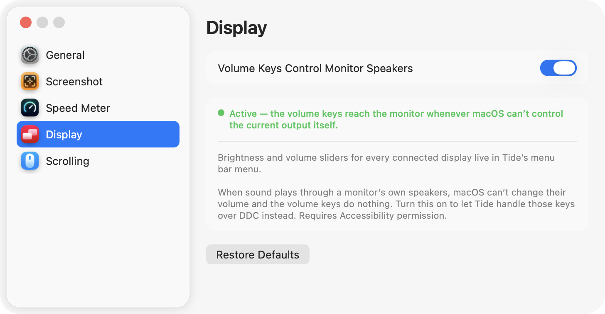

# Tide

macOS menu bar app: tốc độ mạng thời gian thực, chụp ảnh màn hình, và hướng cuộn riêng cho chuột với trackpad — tất cả gọn trong một icon trên menu bar, không chiếm chỗ ở Dock.

Tạo bởi **Louis Chung**.


## Tính năng

### Tốc độ mạng trên menu bar

- Hiển thị 2 dòng xếp chồng ngay trên menu bar — `↑ 13 KB/s` ở trên, `↓ 1.6 MB/s` ở dưới.
- Chỉ cộng lưu lượng của card mạng vật lý (Wi-Fi/Ethernet, `en*`); bỏ qua loopback và interface ảo (VPN, bridge…) để không đếm trùng.
- Chọn được đơn vị (`B/s` cơ số 1024, `B/s` cơ số 1000, hoặc `bit/s`), nhịp cập nhật (0.5s / 1s / 2s / 5s), và ẩn/hiện riêng từng dòng ↑ ↓.
- Đầu menu hiện **tên nhà mạng + IP công cộng**, dạng `VNPT Corp 14.161.12.83` — đây là IP WAN do ISP cấp, không phải IP LAN. Tra qua API công khai `ipinfo.io` (HTTPS), mỗi lần mở app chỉ gọi 1 lần (lỗi thì thử lại ở lần mở menu kế tiếp). Lưu ý: bước tra cứu này gửi IP công khai của bạn tới `ipinfo.io`.

### Chụp ảnh màn hình

- 3 chức năng ngay trong menu: **Selected Area… / Window… / Full Screen**, kèm phím tắt hiện tại của từng mục (vd. `Selected Area…  ⌃⇧4`).
- Mỗi chức năng có 2 đích **độc lập, dùng song song được**: lưu `.png` vào `~/Desktop` và/hoặc copy vào clipboard. Bật cả hai thì một lần chụp ra cả file lẫn clipboard; chỉ bật Copy thì không sinh file thừa (dùng thẳng `screencapture -c`).
- Chụp xong menu bar nháy **"✓ Saved"**, **"✓ Copied"** hoặc **"✓ Saved & Copied"** kèm tiếng chụp ngắn trong ~1.2s rồi tự trở về hiển thị tốc độ mạng.
- Phím tắt là **toàn cục** — bấm được ở bất kỳ đâu, không cần mở menu Tide trước và không cần quyền Accessibility. Mặc định `⌃⇧3` (Full Screen), `⌃⇧4` (Selected Area), `⌃⇧5` (Window); chọn Control thay vì Command để không đụng phím tắt chụp ảnh sẵn có của macOS.

### Điều khiển màn hình

macOS chỉ cho chỉnh độ sáng của màn hình built-in; với màn hình ngoài, cách duy nhất là với tay lên nút vật lý trên monitor. Tide đưa cả hai vào menu bar.

- Mục **Displays** ở đầu menu có một slider độ sáng cho mỗi màn hình đang cắm, kéo tới đâu màn đổi tới đó. Có từ 2 màn trở lên thì mỗi nhóm slider được ghi tên màn hình phía trên.
- Màn hình ngoài có loa thì có thêm slider **âm lượng**. Slider này chỉ hiện khi monitor thực sự trả lời truy vấn âm lượng — phần lớn màn không có loa, và một thanh trượt chết còn tệ hơn là không có.
- Ba đường điều khiển khác nhau, tự chọn theo từng màn:

| Màn hình | Độ sáng | Âm lượng |
|---|---|---|
| Built-in | API DisplayServices của hệ thống | — |
| Ngoài, hỗ trợ DDC/CI | DDC/CI qua cáp video (VCP `0x10`) | VCP `0x62` |
| Ngoài, không có DDC | làm mờ bằng gamma | — |

- **DDC/CI** là giao thức mà chính menu OSD của monitor dùng, chạy qua cáp video, nên chỉnh từ Tide giống hệt bấm nút trên màn. Hầu hết monitor rời đều hỗ trợ; TV, màn qua hub/KVM rẻ tiền thì thường không.
- Màn không có DDC sẽ rơi về **làm mờ bằng gamma**: hình tối đi nhưng đèn nền vẫn sáng như cũ, nên mất một ít độ tương phản ở vùng tối. Chỉ dùng khi không còn cách nào khác, và chỉ giảm được xuống 25% chứ không tắt hẳn (màn đen thui thì không còn thấy menu để chỉnh lại). Đây cũng là giá trị duy nhất Tide tự nhớ — macOS đã nhớ độ sáng màn built-in, monitor DDC nhớ trong firmware của nó, còn gamma thì mất sạch mỗi khi thoát app hoặc rút cáp.
- Cắm/rút màn hình thì menu tự cập nhật (chờ 1.5s cho sắp xếp màn hình ổn định rồi mới dò, vì monitor đang khởi động không trả lời DDC).
- Riêng phần slider không cần cấp quyền gì thêm.

### Phím âm lượng cho loa màn hình

Khi chọn output âm thanh là màn hình ngoài, phím tăng/giảm âm lượng trên bàn phím **không làm gì cả** — macOS hiện dấu cấm. Lý do: thiết bị audio của màn hình qua HDMI/DisplayPort thường không có thuộc tính âm lượng nào để hệ thống chỉnh.

- Bật **Volume Keys Control Monitor Speakers** trong Settings → Display, rồi dùng phím tăng/giảm/tắt tiếng như bình thường — Tide bắt phím và chuyển thành lệnh DDC tới monitor.
- Tide chỉ nhận phím khi macOS **thật sự không chỉnh được** output hiện tại (kiểm tra bằng `kAudioDevicePropertyVolumeScalar`). Đổi output về loa máy là phím trả lại cho macOS ngay, không cần tắt gì.
- Bước nhảy 1/16 giống macOS; giữ `⇧⌥` để chỉnh tinh 1/64. Phím tắt tiếng hạ về 0 và nhớ mức cũ, bấm lại thì khôi phục.
- Chọn đúng màn hình theo tên thiết bị audio (màn hình báo tên trùng với tên hiển thị, vd. `HX270S`); nếu không khớp thì chỉ chấp nhận khi có đúng một màn ngoài có loa — thà không nhận phím còn hơn chỉnh nhầm màn.
- Vì phím đã bị Tide nuốt nên macOS không hiện HUD; Tide hiện **HUD riêng** ngay dưới icon menu bar, kèm tên màn hình và thanh mức.
- Cần quyền **Accessibility** (dùng chung với tính năng đảo hướng cuộn).

### Hướng cuộn riêng cho chuột và trackpad

macOS chỉ có **một** công tắc "Natural scrolling" dùng chung cho mọi thiết bị trỏ: chỉnh đúng chiều cho trackpad thì con chuột bị ngược, và ngược lại.

Tide giải quyết bằng cách để nguyên setting của hệ thống cho một thiết bị, rồi đảo chiều thiết bị còn lại:

- Bật **Reverse Scroll Direction**, rồi chọn **Reverse Mouse** và/hoặc **Reverse Trackpad**. Muốn hai thiết bị ngược chiều nhau thì chỉ bật một trong hai.
- Phân biệt chuột với trackpad theo **đúng thiết bị phát ra event** (đọc IORegistry), không dựa vào kiểu event: Magic Mouse cũng gửi scroll dạng pixel y hệt trackpad nên cách nhận diện thông thường sẽ nhầm nó thành trackpad.
- Chỉ đảo trục dọc — trục ngang giữ nguyên cho các gesture vuốt qua lại.
- Cần quyền **Accessibility**; cấp xong là chạy ngay, không phải khởi động lại app.

### Khác

- **Launch at Login** — tự khởi động cùng macOS (chỉ hoạt động khi chạy từ bản `.app` đã đóng gói).
- **Tự động cập nhật** — mỗi lần mở app tự kiểm tra ngầm bản mới trên GitHub Releases (im lặng nếu đã mới nhất); có bản mới thì hỏi cài luôn: tải `.zip` của release, giải nén, thay thế `/Applications/Tide.app` rồi tự khởi động lại. Kiểm tra thủ công bằng nút **Check for Updates…** trong Settings → General.
- Không có icon ở Dock (`LSUIElement`), chỉ nằm trên menu bar — trừ lúc cửa sổ Settings đang mở, khi đó app hiện ở Dock và ⌘-Tab như app bình thường, đóng cửa sổ là ẩn lại. Nếu Dock vẫn còn icon Tide sau khi đóng Settings thì đó là mục **recent apps** của macOS (Dock ghi lại mọi app từng chạy ở foreground, app không tự gỡ được): tắt "Show suggested and recent apps in Dock" trong System Settings → Desktop & Dock.

## Cửa sổ Settings

Dạng sidebar-tabs giống System Settings, chia theo chức năng. Mỗi nhóm có nút **Restore Defaults** riêng, không ảnh hưởng các nhóm khác.

**Screenshot** — mỗi chức năng một dòng, gồm đủ 2 checkbox Save/Copy (không cho tắt cả hai cùng lúc) và ô phím tắt của chính nó: bấm vào ô để ghi tổ hợp mới, Esc để huỷ, Delete để xoá.


**Display** — công tắc cho phím âm lượng điều khiển loa màn hình ngoài, kèm dòng trạng thái cho biết đang chạy hay còn chờ quyền. Các slider độ sáng/âm lượng nằm trong menu bar chứ không ở đây.



**Speed Meter** — bật/tắt hiển thị tốc độ, chọn dòng ↑ ↓, đơn vị và nhịp cập nhật.


**Scrolling** — đảo hướng cuộn riêng cho chuột và trackpad, kèm dòng trạng thái cho biết đang chạy hay còn chờ quyền.


## Cài đặt

1. Tải `Tide-vX.Y.Z.zip` ở [releases/latest](https://github.com/tuchung95/Tide/releases/latest).
2. Giải nén và kéo `Tide.app` vào `/Applications`.
3. Lần đầu mở: app ký bằng certificate tự tạo (không notarize) nên Gatekeeper sẽ chặn — chuột phải vào app → **Open** → **Open** lần nữa.

Yêu cầu macOS 13 (Ventura) trở lên.

## Quyền cần cấp

| Quyền | Dùng cho | Khi nào hỏi |
|---|---|---|
| **Screen Recording** | Chụp ảnh màn hình | Lần chụp đầu tiên |
| **Accessibility** | Đảo hướng cuộn theo thiết bị; bắt phím âm lượng cho loa màn hình | Khi bật Reverse Scroll Direction hoặc Volume Keys Control Monitor Speakers |

Nếu System Settings đã hiện Tide được bật mà app vẫn báo thiếu quyền: tắt rồi bật lại mục Tide trong danh sách. macOS gắn quyền theo chữ ký của bản build, nên một entry cũ vẫn nằm trong danh sách nhưng không còn hiệu lực — chi tiết và cách chẩn đoán ở mục [Chữ ký và quyền hệ thống](#chữ-ký-và-quyền-hệ-thống).

## Build từ source

Cần Xcode Command Line Tools (có `swiftc`, `codesign`), **không cần** Xcode.app đầy đủ.

```bash
# Build + ký + cài đè vào /Applications + publish GitHub Release
./Scripts/build_app.sh

# Chỉ build + cài local, giữ nguyên version, không publish
SKIP_RELEASE=1 ./Scripts/build_app.sh
```

Script compile thẳng bằng `swiftc` (SwiftPM cần SDK path chỉ có trong Xcode.app đầy đủ), tự tăng patch version trong `Resources/VERSION`, đóng gói `Tide.app`, rồi ký bằng certificate `Tide Local Dev` dùng chung (xem bên dưới). Build local (`SKIP_RELEASE=1`) không có certificate thì rơi về ký ad-hoc; build release thì **bị chặn** — không bao giờ publish một bản ký sai chữ ký.

Trang Releases chỉ giữ đúng bản mới nhất: publish xong, script tự xoá mọi release cũ hơn kèm tag của chúng.

## Chữ ký và quyền hệ thống

macOS lưu quyền Screen Recording / Accessibility theo *designated requirement* của app: `identifier "com.tide.menubar" and certificate leaf = H"<SHA-1 của certificate>"`. Hệ quả:

- Ký ad-hoc (`--sign -`): requirement gắn vào hash của binary → mỗi lần rebuild là một app "mới", quyền mất.
- Ký bằng certificate tự tạo: requirement gắn vào certificate → rebuild bao nhiêu lần vẫn giữ quyền, **miễn là cùng một certificate**.
- Hai máy mỗi máy tự tạo một `Tide Local Dev` riêng → tên giống nhưng hash khác. Release build từ máy A auto-update sang máy B sẽ làm B mất toàn bộ quyền, dù System Settings vẫn hiện Tide đang được bật.

Vì vậy **toàn bộ máy build phải dùng chung một certificate**, hash được pin ở `SIGNING_LEAF` trong `Scripts/build_app.sh`. Script chọn identity theo hash (không theo tên) và kiểm tra lại requirement sau khi ký. Phía nhận, `UpdateInstaller` từ chối cài bản cập nhật không cùng chữ ký với bản đang chạy, thay vì âm thầm phá quyền.

### Thêm một máy build mới

Trên máy đã có certificate (máy gốc), export cả private key ra `.p12`:

```bash
security export -k login.keychain -t identities -f pkcs12 -o ~/Desktop/TideLocalDev.p12
# nhập mật khẩu bảo vệ file khi được hỏi
```

Chuyển file sang máy mới (AirDrop, không commit vào repo), rồi import và cho `codesign` được dùng key:

```bash
security import ~/Desktop/TideLocalDev.p12 -k ~/Library/Keychains/login.keychain-db -T /usr/bin/codesign
security find-identity -v -p codesigning   # phải thấy đúng hash 0C3381B9A5B46311AA9E6D3CC99567B4E4BB8831
```

Nếu máy mới trước đó đã tự tạo một `Tide Local Dev` khác, xoá nó đi trong Keychain Access để tránh lẫn; các quyền đã cấp cho bản ký bằng cert cũ trên máy đó sẽ phải cấp lại **một lần** (`tccutil reset ScreenCapture com.tide.menubar; tccutil reset Accessibility com.tide.menubar`, rồi bật lại từ prompt của app).

### Nếu quyền đã cấp mà app vẫn hỏi lại

So requirement của bản đang cài với entry TCC:

```bash
codesign -d -r- /Applications/Tide.app
sudo sqlite3 "/Library/Application Support/com.apple.TCC/TCC.db" \
  "select service, auth_value, hex(csreq) from access where client='com.tide.menubar';"
```

20 byte cuối của `csreq` là hash certificate mà TCC đang mong đợi. Khác với `certificate leaf` của app → app đang cài được ký bằng cert khác: build lại bằng cert chung (`SKIP_RELEASE=1 ./Scripts/build_app.sh`) hoặc `tccutil reset` rồi cấp lại.

Gatekeeper vẫn chặn lần mở đầu vì certificate tự tạo không được Apple notarize (chuột phải → Open). Muốn bỏ bước này cần Apple Developer ID + notarization (tài khoản Apple Developer trả phí); cách pin certificate ở trên vẫn đúng y như vậy với Developer ID, chỉ đổi hash.
